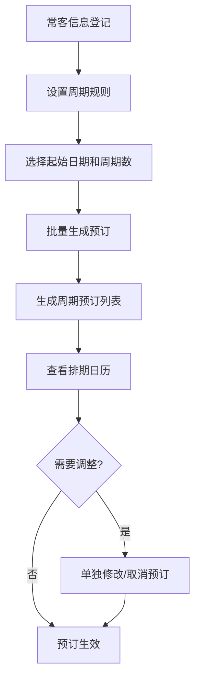
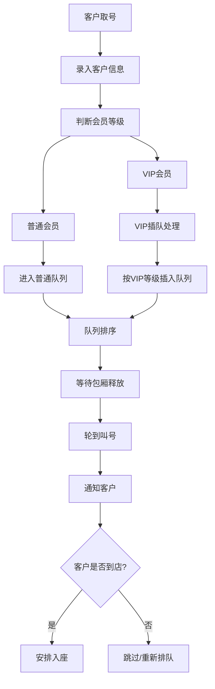
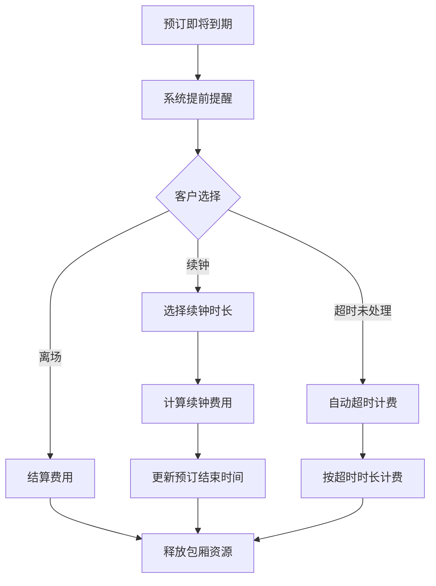

## 1. 产品概述

KTV包厢预订管理后台是一套面向KTV门店运营的管理系统，解决包厢资源调度、常客周期预订、高峰排队叫位等核心业务问题。系统通过可视化排期、周期批量生成、优先级队列和VIP插队机制，提升门店运营效率和顾客体验。

目标用户：KTV门店店长、前台接待、运营管理人员。

核心价值：减少人工调度错误、提升包厢利用率、优化高峰时段客流管理、增强VIP客户服务体验。

## 2. 核心功能

### 2.1 用户角色

| 角色 | 登录方式 | 核心权限 |
|------|----------|----------|
| 管理员 | 账号密码登录 | 全部功能：包厢管理、周期规则、排期查看、排队叫位、VIP管理、数据统计 |
| 前台接待 | 账号密码登录 | 排期查看、排队叫位、预订录入、酒水套餐选择、续钟计费 |

### 2.2 功能模块

1. **包厢排期模块**：包厢资源建档、日历视图排期、预订详情管理、状态切换
2. **周期生成模块**：周期规则设定、常客信息管理、批量生成未来预订、单独调整预订
3. **排队叫位模块**：优先级队列维护、叫号通知、队列状态展示、叫位历史记录
4. **优先插队模块**：VIP会员管理、插队处理、优先级调整、权益配置

### 2.3 页面详情

| 页面名称 | 模块名称 | 功能描述 |
|---------|---------|----------|
| 包厢排期页 | 包厢资源建档 | 新增/编辑/删除包厢，设置包厢类型、容纳人数、设备配置、小时单价 |
| 包厢排期页 | 日历排期视图 | 按日/周/月视图展示包厢占用情况，支持拖拽调整预订时段 |
| 包厢排期页 | 预订详情管理 | 查看预订详情，修改客户信息、时段、包厢，支持取消预订 |
| 包厢排期页 | 酒水套餐选择 | 预订时选择酒水套餐，记录套餐内容和价格 |
| 包厢排期页 | 超时续钟计费 | 预订超时自动计费，支持手动续钟，计算续钟费用 |
| 周期生成页 | 周期规则设定 | 设置周期类型（每周/每两周/每月）、固定时段、持续周期数 |
| 周期生成页 | 常客信息管理 | 维护常客信息，关联会员等级、联系方式、历史消费记录 |
| 周期生成页 | 批量生成预订 | 根据周期规则批量生成未来指定周期内的所有预订记录 |
| 周期生成页 | 单独调整预订 | 对周期生成的单条预订进行修改、取消或替换包厢 |
| 排队叫位页 | 优先级队列维护 | 实时展示排队队列，按优先级排序，显示等待人数和预估等待时间 |
| 排队叫位页 | 叫号通知 | 一键叫号，支持语音播报和列表高亮，记录叫号状态 |
| 排队叫位页 | 叫位历史记录 | 记录所有叫位历史，包括叫号时间、入座时间、取消记录 |
| 优先插队页 | VIP会员管理 | VIP会员信息录入、等级设置、权益配置、积分管理 |
| 优先插队页 | VIP插队处理 | VIP客户可优先插队，自动调整队列顺序，记录插队原因 |
| 优先插队页 | 优先级配置 | 定义不同会员等级的插队权重、排队优先级、专属服务 |
| 数据统计页 | 运营报表 | 包厢利用率、收入统计、客流量分析、VIP消费占比 |

## 3. 核心流程

### 3.1 周期预订流程

常客在前台登记固定时段信息，管理员设置周期规则，系统批量生成未来N周的预订记录，前台可单独调整某次预订。

### 3.2 排队叫位流程

高峰时段包厢满员时，客户取号进入排队队列，系统按优先级排序，包厢空出后按顺序叫号，VIP可优先插队。

### 3.3 超时续钟流程

预订时间即将结束时系统提醒，客户选择续钟或离场，超时自动计费并更新预订状态。

## 4. 用户界面设计

### 4.1 设计风格

- **主色调**：深邃紫色 (#6366F1) 搭配金色点缀 (#F59E0B)，体现KTV娱乐氛围与尊贵感
- **辅助色**：深灰 (#1F2937) 作为背景基调，营造高端夜店风格
- **按钮风格**：圆角设计，带微光渐变效果，悬停时有发光动效
- **字体**：标题使用衬线字体体现品质感，正文使用现代无衬线字体确保可读性
- **布局风格**：卡片式布局，左侧导航 + 顶部状态栏 + 主内容区，深色主题
- **图标风格**：线性图标，统一粗细和圆角，使用品牌色填充

### 4.2 页面设计概述

| 页面名称 | 模块名称 | UI元素 |
|---------|---------|-------|
| 包厢排期页 | 顶部工具栏 | 日期选择器、视图切换（日/周/月）、搜索筛选、新增预订按钮 |
| 包厢排期页 | 排期主视图 | 时间轴网格，包厢列为行，时段色块表示占用状态，不同颜色区分预订类型 |
| 包厢排期页 | 预订详情弹窗 | 客户信息、时段选择、包厢信息、酒水套餐、费用明细 |
| 周期生成页 | 规则配置表单 | 周期类型选择、星期多选、开始/结束时间、持续周期数 |
| 周期生成页 | 周期预订列表 | 表格展示所有生成的预订，支持单条编辑、批量操作 |
| 排队叫位页 | 队列看板 | 大号数字显示当前叫号，队列列表按优先级排序，彩色标签区分VIP等级 |
| 排队叫位页 | 叫号操作区 | 叫号按钮、跳过按钮、重新排队按钮，大尺寸便于操作 |
| 优先插队页 | VIP会员列表 | 卡片式展示VIP信息，头像、等级、积分、有效期 |
| 优先插队页 | 插队操作面板 | 选择VIP会员、选择目标队列、插队位置预览、确认操作 |

### 4.3 响应式

- 桌面端优先设计，1280px及以上为最佳显示宽度
- 平板端（768-1279px）：侧边栏收起为图标导航，内容区自适应
- 移动端（< 768px）：底部Tab导航，卡片单列排布，表格转为列表式展示
- 叫号页面支持大屏展示模式，字号放大，适合门店电视屏幕

### 4.4 动效与交互

- 页面切换采用淡入淡出过渡动画
- 排队叫号时有数字跳动动画和提示音
- 预订卡片悬停时有上浮和阴影加深效果
- 状态变更时有颜色渐变过渡
- VIP插队时有平滑的队列重排动画
