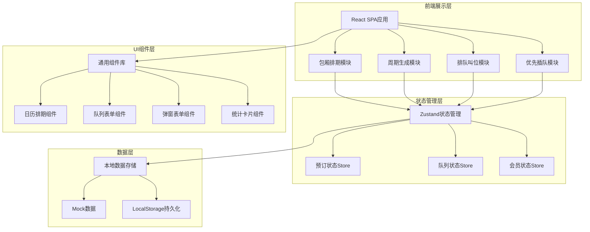
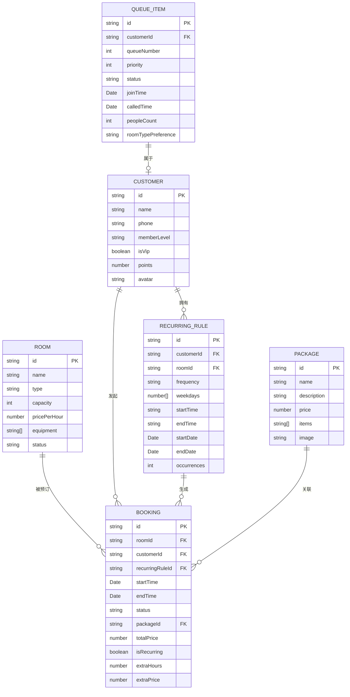

## 1. 架构设计



## 2. 技术描述

- **前端框架**：React 18 + TypeScript
- **构建工具**：Vite 5
- **样式方案**：Tailwind CSS 3
- **状态管理**：Zustand
- **路由管理**：React Router DOM 6
- **图标库**：Lucide React
- **日期处理**：date-fns
- **数据存储**：LocalStorage + Mock数据（纯前端演示）
- **UI组件**：自研组件库（基于Tailwind CSS）

## 3. 路由定义

| 路由路径 | 页面名称 | 功能描述 |
|---------|---------|----------|
| / | 包厢排期页 | 日历视图展示包厢排期，预订管理 |
| /schedule | 包厢排期页 | 同上（主页面） |
| /recurring | 周期生成页 | 周期规则设置、批量生成预订 |
| /queue | 排队叫位页 | 队列管理、叫号操作 |
| /vip | 优先插队页 | VIP会员管理、插队处理 |
| /rooms | 包厢管理页 | 包厢资源建档、设备配置 |
| /packages | 酒水套餐页 | 酒水套餐配置管理 |
| /stats | 数据统计页 | 运营数据报表 |

## 4. 数据模型

### 4.1 数据模型定义



### 4.2 核心数据类型定义

```typescript
// 包厢类型
type RoomType = 'small' | 'medium' | 'large' | 'vip' | 'party';

interface Room {
  id: string;
  name: string;
  type: RoomType;
  capacity: number;
  pricePerHour: number;
  equipment: string[];
  status: 'active' | 'maintenance' | 'disabled';
  floor: number;
}

// 客户类型
type MemberLevel = 'normal' | 'silver' | 'gold' | 'platinum' | 'diamond';

interface Customer {
  id: string;
  name: string;
  phone: string;
  memberLevel: MemberLevel;
  isVip: boolean;
  points: number;
  avatar?: string;
  totalSpent: number;
  visitCount: number;
}

// 预订状态
type BookingStatus = 'pending' | 'confirmed' | 'in_use' | 'completed' | 'cancelled' | 'extended';

interface Booking {
  id: string;
  roomId: string;
  customerId: string;
  recurringRuleId?: string;
  startTime: Date;
  endTime: Date;
  status: BookingStatus;
  packageId?: string;
  totalPrice: number;
  isRecurring: boolean;
  extraHours: number;
  extraPrice: number;
  peopleCount: number;
  remarks?: string;
}

// 周期规则
type RecurringFrequency = 'weekly' | 'biweekly' | 'monthly';

interface RecurringRule {
  id: string;
  customerId: string;
  roomId: string;
  frequency: RecurringFrequency;
  weekdays: number[];
  startTime: string;
  endTime: string;
  startDate: Date;
  endDate?: Date;
  occurrences?: number;
  packageId?: string;
  isActive: boolean;
}

// 酒水套餐
interface Package {
  id: string;
  name: string;
  description: string;
  price: number;
  originalPrice: number;
  items: PackageItem[];
  category: 'beer' | 'wine' | 'spirit' | 'snack' | 'combo';
  image?: string;
}

interface PackageItem {
  name: string;
  quantity: number;
  unit: string;
}

// 排队项
type QueueStatus = 'waiting' | 'called' | 'seated' | 'cancelled' | 'no_show';

interface QueueItem {
  id: string;
  customerId: string;
  queueNumber: number;
  priority: number;
  status: QueueStatus;
  joinTime: Date;
  calledTime?: Date;
  seatedTime?: Date;
  peopleCount: number;
  roomTypePreference: RoomType;
  isVip: boolean;
  vipLevel?: MemberLevel;
  calledCount: number;
  estimatedWaitTime?: number;
}

// 优先级配置
interface PriorityConfig {
  level: MemberLevel;
  weight: number;
  queuePriority: number;
  canSkipQueue: boolean;
  skipLimitPerDay: number;
  benefits: string[];
}
```

## 5. 核心模块说明

### 5.1 状态管理模块

使用Zustand创建三个核心Store：

1. **useBookingStore** - 预订与排期管理
   - 包厢列表管理
   - 预订CRUD操作
   - 周期预订生成
   - 续钟计费计算

2. **useQueueStore** - 排队叫位管理
   - 队列维护与排序
   - 叫号操作
   - VIP插队处理
   - 预估等待时间计算

3. **useCustomerStore** - 客户与会员管理
   - VIP会员信息维护
   - 常客信息管理
   - 会员等级与权益配置

### 5.2 工具函数模块

- **dateUtils** - 日期时间处理、时间段计算
- **priceUtils** - 费用计算、套餐价格计算、超时计费
- **queueUtils** - 队列排序、优先级计算、预估等待时间
- **recurringUtils** - 周期规则解析、批量生成预订日期

### 5.3 组件模块

- **ScheduleCalendar** - 日历排期组件，支持日/周/月视图
- **BookingForm** - 预订表单弹窗
- **QueueBoard** - 排队看板组件
- **VipCard** - VIP会员卡组件
- **RoomCard** - 包厢信息卡片
- **PackageSelector** - 酒水套餐选择器
- **StatCard** - 统计数据卡片

## 6. 项目目录结构

```
src/
├── components/           # 通用组件
│   ├── layout/          # 布局组件
│   │   ├── Sidebar.tsx
│   │   ├── Header.tsx
│   │   └── Layout.tsx
│   ├── schedule/        # 排期相关组件
│   │   ├── ScheduleCalendar.tsx
│   │   ├── BookingCard.tsx
│   │   └── TimeAxis.tsx
│   ├── queue/           # 排队相关组件
│   │   ├── QueueBoard.tsx
│   │   ├── QueueItem.tsx
│   │   └── CallNumberDisplay.tsx
│   ├── vip/             # VIP相关组件
│   │   ├── VipCard.tsx
│   │   └── VipSelector.tsx
│   ├── common/          # 通用UI组件
│   │   ├── Button.tsx
│   │   ├── Modal.tsx
│   │   ├── Input.tsx
│   │   ├── Select.tsx
│   │   └── StatCard.tsx
│   └── booking/         # 预订相关组件
│       ├── BookingForm.tsx
│       ├── PackageSelector.tsx
│       └── ExtendHourModal.tsx
├── pages/               # 页面组件
│   ├── Schedule.tsx
│   ├── Recurring.tsx
│   ├── Queue.tsx
│   ├── Vip.tsx
│   ├── Rooms.tsx
│   ├── Packages.tsx
│   └── Stats.tsx
├── stores/              # Zustand状态管理
│   ├── useBookingStore.ts
│   ├── useQueueStore.ts
│   └── useCustomerStore.ts
├── data/                # Mock数据
│   ├── rooms.ts
│   ├── customers.ts
│   ├── bookings.ts
│   ├── packages.ts
│   └── queue.ts
├── utils/               # 工具函数
│   ├── dateUtils.ts
│   ├── priceUtils.ts
│   ├── queueUtils.ts
│   └── recurringUtils.ts
├── types/               # TypeScript类型定义
│   └── index.ts
├── App.tsx
├── main.tsx
└── index.css
```
